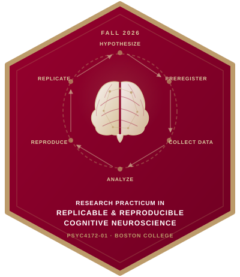

<link rel="stylesheet" href="https://cdnjs.cloudflare.com/ajax/libs/font-awesome/6.5.1/css/all.min.css">

::: hero-banner
[PSYC4172-01]{.course-code}

# Replicable & Reproducible Cognitive Neuroscience

[A hands-on practicum in open, transparent, and reproducible psychological science]{.subtitle}
:::

::::::::::::::::::: info-cards
:::::: info-card
<i class="fa-solid fa-chalkboard-user"></i>

::: info-label
Instructor
:::

::: info-value
Dr. Jason Geller
:::

::::::

:::::: info-card
<i class="fa-solid fa-calendar-days"></i>

::: info-label
Semester
:::

::: info-value
Fall 2026
:::

::::::

:::::: info-card
<i class="fa-solid fa-clock"></i>

::: info-label
Meeting Time
:::

::: info-value
Thu 4:00–6:30 PM
:::

::::::

:::::: info-card
<i class="fa-solid fa-location-dot"></i>

::: info-label
Location
:::

::: info-value
McGuinn Hall 332
:::

::::::
:::::::::::::::::::

:::: {.hex-showcase}
{.hex-sticker-home}
::::

##  {.section-heading}

Course Description

This hands-on practicum introduces students to the principles and practices of open, replicable, and reproducible psychological science. Students gain experience with the full research lifecycle, from preregistration and open data management to transparent analysis and reporting, with replication and reproducibility emphasized as the cornerstones of cumulative scientific progress.

Throughout the semester, students work in teams to design and conduct a close replication of a published psychology experiment using the Human Neuroscience Laboratory (HNL) facilities. The course covers key topics including open science practices, reproducible research workflows, data sharing and documentation, scientific integrity, experiment development and data analysis.

By the end of the course, students will have completed a preregistered replication study, produced a fully reproducible research report, and presented their findings in a conference-style format.

##  {.section-heading}

Learning Goals

::::::::::::::::::::: goals-grid
::::: goal-card
::: goal-icon
<i class="fa-solid fa-repeat"></i>
:::

::: goal-text
Understand the principles of replication and reproducibility and their role in cumulative science
:::
:::::

::::: goal-card
::: goal-icon
<i class="fa-solid fa-file-signature"></i>
:::

::: goal-text
Develop and submit a preregistration for a replication study
:::
:::::

::::: goal-card
::: goal-icon
<i class="fa-solid fa-brain"></i>
:::

::: goal-text
Design and run a cognitive neuroscience experiment using HNL facilities
:::
:::::

::::: goal-card
::: goal-icon
<i class="fa-solid fa-code"></i>
:::

::: goal-text
Build reproducible analysis pipelines using R, Quarto, and version control
:::
:::::

::::: goal-card
::: goal-icon
<i class="fa-solid fa-database"></i>
:::

::: goal-text
Practice open data management, documentation, and sharing via OSF
:::
:::::

::::: goal-card
::: goal-icon
<i class="fa-solid fa-users"></i>
:::

::: goal-text
Present findings in a professional conference-style poster session
:::
:::::
:::::::::::::::::::::
